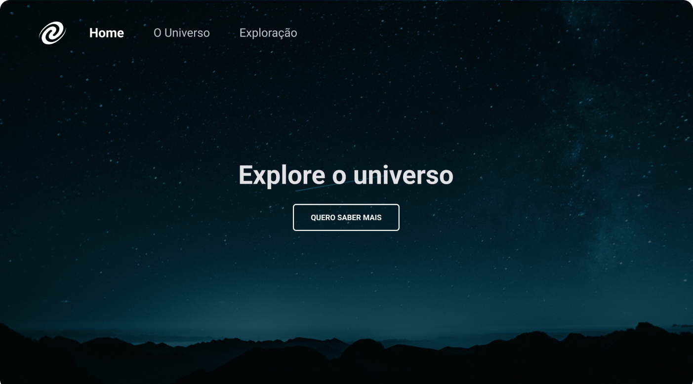

# SPA Universe

Desafio "SPA Universe" do Explorer da Rocketseat, cujo objetivo foi a criação de uma página sobre a exploração do Universo.

Os tópicos abordados nesse projeto são:
- [x] Conceitos de SPA;
- [x] Mapeamento de rotas;
- [x] Assíncrono e promisses;
- [x] Orientação a objetos;
- [x] Classes e muito mais;