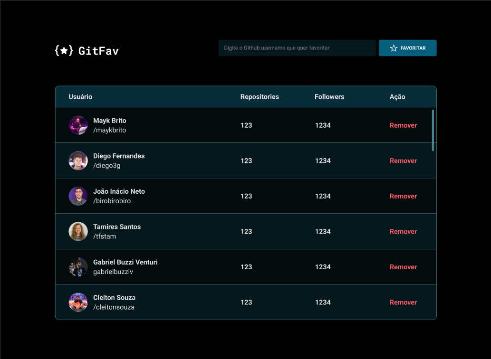

# Projeto GitFav

O GitFav é um projeto do explorer da Rocketseat, onde podemos encontrar usuários do Github, favorita-los, mostrando a quantidade de repositórios e seguidores que ele tem.

Os tópicos abordados nesse projeto são:
-[X] API's;
-[X] Tables;
-[X] POO;
-[X] localStorage;
-[X] Métodos estáticos e promessas;